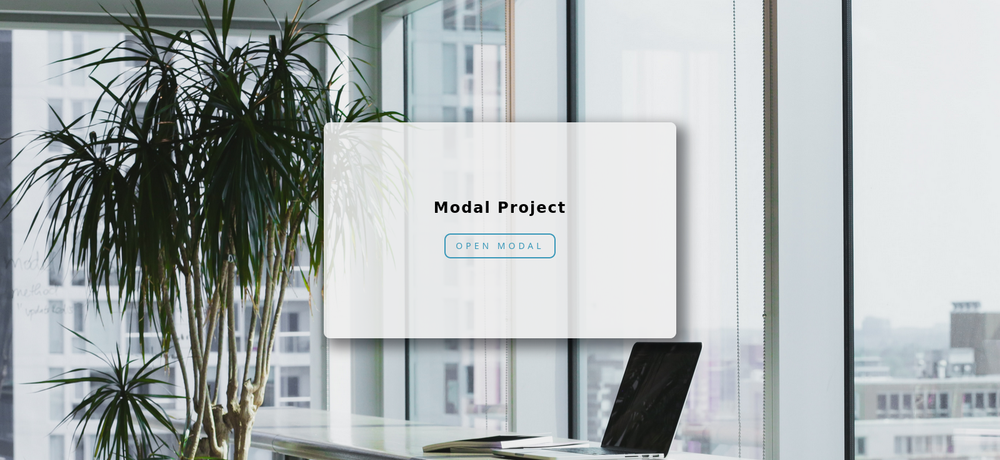
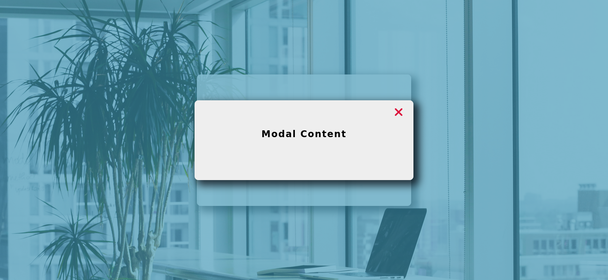

# Modal Component

A sample component for a modal dialog box that is displayed and hidden using buttons.

## Screenshots

## Installation

1. Clone the repository `https://github.com/AlexdelCarmen/modal-component`.

2. Open `index.html` in your browser. 

## Features

- Open modal button that brings up modal dialog.
- Close button on the top right of modal dialog.

## Technologies

- HTML
- CSS
- JavaScript

## License

This source code is licensed under the Unlicense.  See the [LICENSE](./LICENSE) file for details.

## Credits

- Inspired on John Smilga's [video](https://youtu.be/3PHXvlpOkf4) for freeCodeCamp. 

- Coded by [Alejandro Borges](https://github.com/AlexdelCarmen)